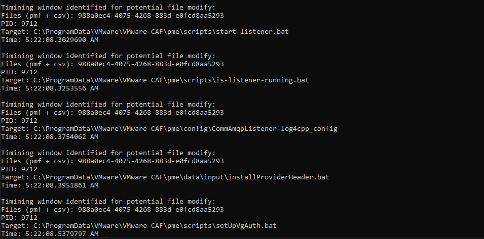



# VulnFinder
This is a research tool that aims to build pattern matching around common vulnerable indicators that can be identified using Procmon. I'm a total noob at hunting for LPEs so I wanted a way to get very specific about what this behavior looks like and automate the vuln hunting process.

The procmon filter being used in this project is:

`Integrity|is|medium|Exclude` - We want high or system

`Detail|contains|Impersonating: desktop|Exclude` - My user is in the desktop-asdf group so we don't care about those

All checks expect the filter to have those settings

## Checks

### 1) File modify
http://sandboxescaper.blogspot.com/2019/12/chasing-polar-bears-part-one.html

This blog goes through an example of a file modify vulnerable indicator that I have implemented a check for. The gist is that there's an msi file in C:\Windows\Installer that is authored by VMWare. 

When my code is kicked off, `msiexec /fa C:\Windows\Installer\whatever.msi`will run and procmon will record its behavior. Those results will then be saved, converted into csv, and then checked against the following logic:

`if there's a CreateFile NAME NOT FOUND and CreateFile with delete permission and SetRenameInformationFile near each other for the same path and BUILTIN\Users has write access to the folder then this is a vulnerability`

Running that results in many potential file modify vulns being identified including the one chosen in that blog post, *stop-listener.bat,* as we would expect.

### 2) DLL Hijacking
As detailed in EternalBrett's Goverlan Reach Agent EoP, I've implemented a check for dll hijacking vulnerabilities using the following logic:

`if BUILTIN\Users has full control over a folder in which there is a CreateFile SUCCESS and there is also a CreateFile NAME NOT FOUND followed by a Load Image s.t. they have the same filename then this is a dll available for hijacking`

Additionally:

`if there's ever a Load Image to a directory BUILTIN\Users has full control of then that's a vulnerability`

### 3) Executable code control
Just like here: https://aspe1337.blogspot.com/2017/04/writeup-of-cve-2017-7199.html

Implemented as:

`if BUILTIN\Users has write access to a path in which there is a CreateFile NO SUCH FILE where Path=*.dll or Path=*.exe then this demonstrates executable code control`

## Example

This is an example implementation of main which showcases how simple it is to set up this tool. In this example, we're running `msiexec` with the `/fa` debug flag on every msi file in `C:\Windows\Installer`.

## Adding fuzzing and automation
This project is meant to be agnostic to the method that you're using to make "noise" for procmon. You could make it restart every service, run `msiexec /fa` on every msi, whatever you want. Then if one of those iterations causes behavior indicative of LPE then you will know.

https://googleprojectzero.blogspot.com/2019/12/calling-local-windows-rpc-servers-from.html

James Forshaw recently released a library that can be used to call local RPC servers from .NET. This seems like a cool idea because you can do crazy stuff in .NET like reflection. Basically his blog post walks you through generating RPC server C# definitions that you can import and use. At some point I want to see if I can import _all_ RPC servers into the visual studio project, then use reflection to invoke all "fuzzable" functions (that take params like string, int, etc) and detect their vulnerable behavior.